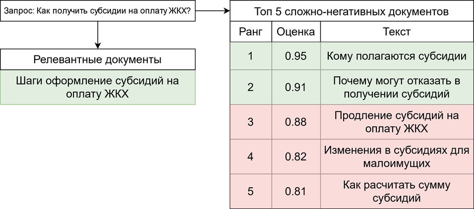
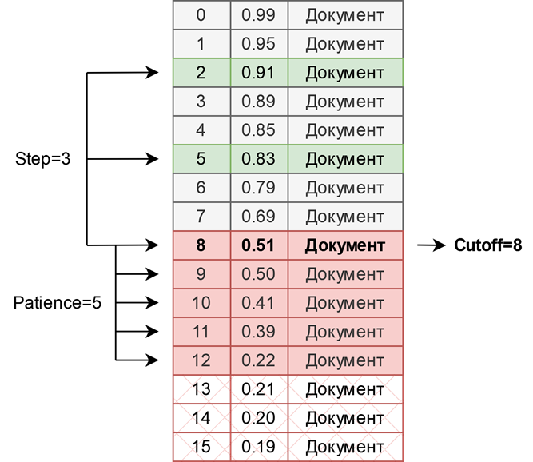

# LLM-Cutoff
### Фильтрация сложно-негативных примеров при помощи LLM

Файл demo.ipynb содержит демонстрацию создания сложно-негативных примеров, а также различных варианты их фильтрации необходимой для решения проблемы ложно-негативных примеров. Демонстрация такой проблемы приведена на рисунке ниже   

В отличие от фильтрации по скорам (вещественным оценкам ранжирующей модели), предлагаемый в данной работе метод используем большие языковые модели (LLM) для определения бинарной релевантности документов запросу. Посредством чего подбирается оптимальная точка отсечения ранжированного списка, обеспечивая тем самым лушее качество итоговых негативных примеров. Демонстрация работы метода приведена ниже

Параметры алгоритма:
- step - шаг обхода списка
- patience - кол-во подряд идущих не релевантных документов для определения порога