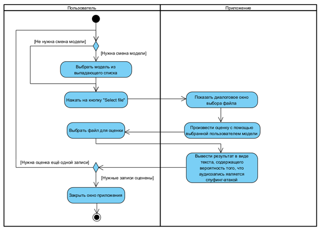
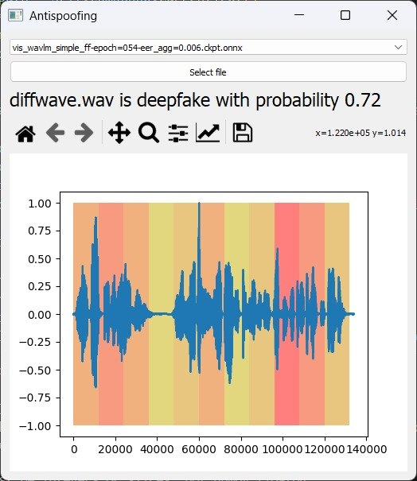

## Руководство пользователя
## 1 Назначение
Программа предназначена для применения моделей, основанных на WAV-LM Large к аудиозаписям с целью определения факта того, являются ли предоставленные аудиозаписи дипфейками. Программа может применяться для противодействия взлому биометрических систем, социальной инженерии на основе дипфейков и др. и использоваться в различных сферах, таких как банковское дело, клиентский сервис, исследования и др.

## 2 Порядок работы
Пользователь выбирает модель для использования, затем выбирает интересующий его аудиофайл в формате .wav для проверки на наличие дипфейка. Программа выдаёт ответ в виде вероятности того, что выбранная аудиозапись является дипфейком.

## 3 Функциональные возможности
- Определение, является ли предоставленная запись дипфейком
- Выбор модели на основе W2V или WAV-LM Large для работы
- Выбор аудиозаписи для проверки

## 4. Системные требования
### 4.1 Требования к техническим средствам
- CPU: от 2 ядер, от 2,0 кГц
- RAM: от 16 Гб
- GPU: NVIDIA от 16 Гб
- Свободное место на жёстком диске: от 500 Мб

### 4.2 Требования к программным средствам
- Операционная система: Windows 10 64 bit/Linux 6.0 64 bit
- Python 3,9
- CUDA 11,8
- Библиотеки программного кода Python:
  - PyQt5
  - onnxruntime
  - soundfile
  - numpy

## 5 Запуск программы
### 5.1 Авторизация
Авторизация не требуется

### 5.2 Интерфейс системы
Входные данные: аудиозапись (.wav)
Выходные данные: вероятность того, что аудиозапись является дипфейком

## 6 Демонстрационный пример
